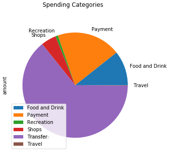
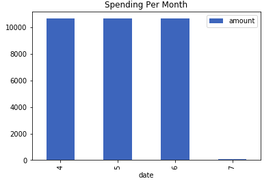

# Financial Report

In this section, I have included a financial report to demonstrate my calculations to offer budgeting and financial planning services to customers of the Consumer Division of Harold's company. This is primariy done using the transaction and account data from Plaid API and historical closing prices for a retirement portfolio pulled from Alpaca trade API. Using the data, I have looked at the Budget Analysis and Retirement Planning. The analyses are as follows:

## Budget Analysis
 
 <b> Assumptions
    
    I have used plaid-python API to generate the correct authentication tokens to access data in the free developer Sandbox
    
    Used the client to generate a public token and requested the following items: ['transactions', 'income', 'assets'] for 
    INSTITUTION_ID = "ins_109508", exchanged the public token for an access token
    
    Used the access token to fetch the transactions for the last 90 days as of 10 July 2020. Sample of transactions is shown in table below
   

 
 <b> Findings, Tables and Graphs
    
    Total Spending per Category is analyzed and below is the table with spent per category and also pie representation
   
  
    
    Total Spending per Month is analyzed and below is the table with amount spent and representated through bar chart
   
 

    Income Analysis was completed and below was determined:

    Previous year's gross income is $7,285
    Current monthly income is $500
    Projected yearly income is $6,085

## Retirement Planning: Summarize the retirement portfolio analysis and include the charts for the Monte Carlo simulation.

 <b> Assumptions
     
    In this section, I have used the Alpaca API to fetch 2019 closing prices for a retirement portfolio which consists of S&P 500 ("SPY") stocks and African Gold Group ("AGG") bonds. 
    
    Ran Monte Carlo simulation of '500' runs to project the portfolio performance at `30` years. This included calculating average daily returns, standard deviations (volatility) and creating a portfolio with 60% stocks of SPY and 40% stocks
    
    Used the Monte Carlo data to answer questions about the portfolio. 

    Below are the samples of Retirement Portfolio Returns, daily ROI of stocks and Cumulative Portfolio Returns post monte carlo simulation 
 

 

 <b> Findings, Tables and Graphs
   
    Simulated Cumulative Retirement Portfolio Return over the next 30 years ranges from $53.4 to $ 593.1 with median return of $199.6

    
    Applying 90% confidence interval for calculating the simulated ending prices, the range changes from $94.4 to $379.4 and shown below

    Expected cumulative returns at 30 years for the 10th, 50th, and 90th percentiles $108.8, $199.6 and $309.7 respectively

    
    Expected cumulative returns at 30 years for the 10th, 50th, and 90th percentiles with $20,000 initial investments are 
    $2.2 million, $4 million and $6.2 respectively

    Above analysis show that that the expected portfolio returns are phenomenal. Projected Yearly Income from Plaid is $ 6,085 while 4% withdrawal from the retirement portfolio at 10th percentile is $87,056 which exceeds the income.
    
    Additionally increasing the initial investment to $30,000 and 4% withdrawal results in $30,000 at the 10th percentile which again exceeds Current projected Income of $6085
    
## Optional Challenge
    
    I have used used the simulated portfolio cumulative returns for 30 years from the Monte Carlo simulation and calculated the cumulative returns at the `5%`, `50%`, and `95%` quartiles. These are 
   
    
    Cumulative returns over 5 years time are analyzed plotted as below

  

### Resources

* [Plaid API Docs](https://plaid.com/docs/)

* [AlpacaDOCS](https://alpaca.markets/docs/)

* [Mastering Markdown](https://guides.github.com/features/mastering-markdown/)
